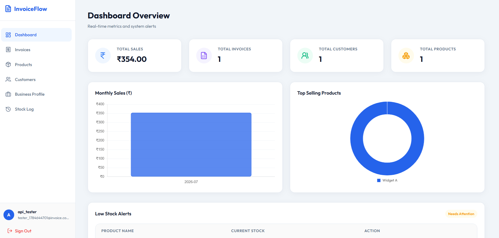
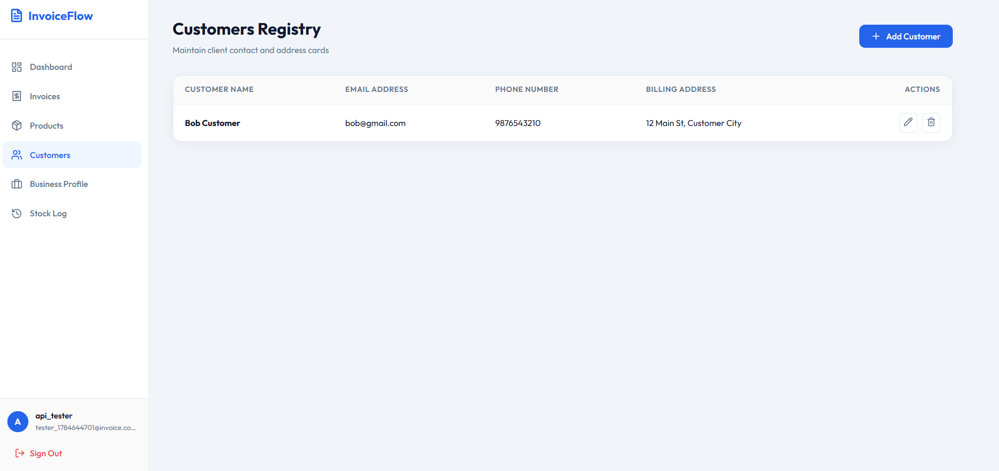
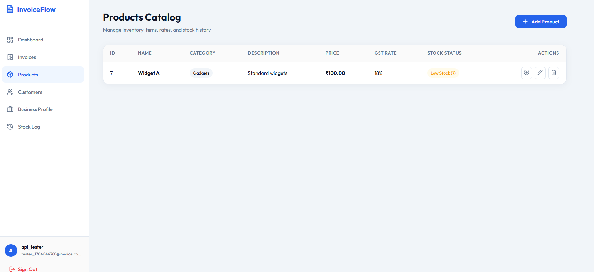
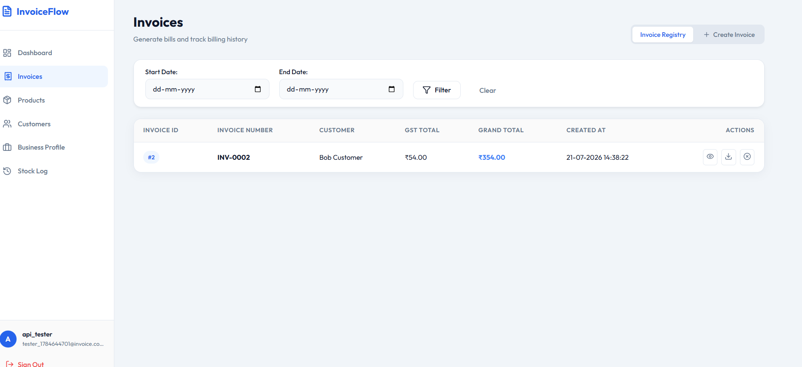
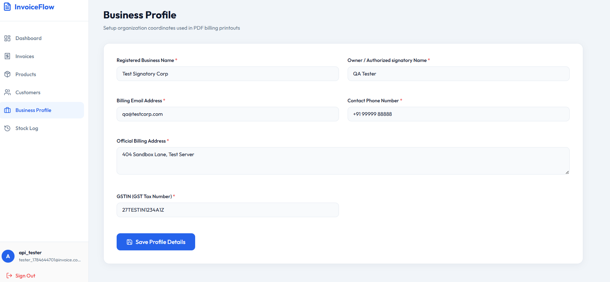
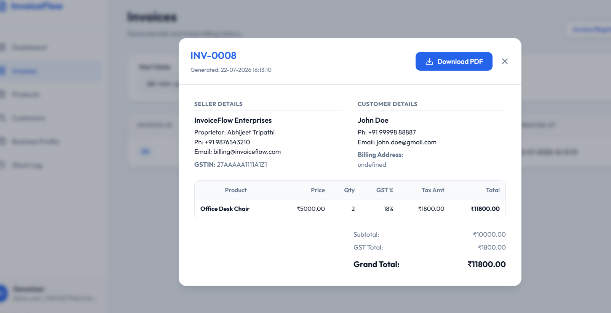

# InvoiceFlow - Modern Invoice Maker

InvoiceFlow is a complete, self-contained billing management web application. It features a responsive Light Mode single-page dashboard, customer/product catalogs (CRUD), automated stock depletion tracking, and dynamic ReportLab PDF invoice generation.

---

## System Architecture

The project is split into two independent parts running on same-origin proxy settings to prevent CORS issues:

* **Backend (`backend/`)**: Python Flask REST API utilizing SQLite, Flask-SQLAlchemy, and JWT authentication (`flask-jwt-extended`).
* **Frontend (`frontend/`)**: Modern Single Page Application (SPA) built using Vanilla JavaScript, HTML5, CSS3 variables, and Chart.js.
* **API Proxy (`frontend/serve.py`)**: A lightweight Python server that hosts the frontend and proxies `/api/*` calls to the Flask backend without needing Node.js or `npm`.

---

## Installation & Setup

### 1. Backend Setup
Activate your Python virtual environment and install the required dependencies:
```powershell
# 1. Activate the virtual environment
.\venv\Scripts\activate

# 2. Install Python dependencies
pip install -r requirment.txt
```

### 2. Frontend Setup
The frontend requires **zero** external installation! Since it uses standard Python library proxy tools, no `npm install` or internet connection is required to serve the frontend.

---

## Running the Servers

To run the application locally, you will need to open **two separate terminal windows** inside the project root:

### Terminal 1: Start the Backend Server
```powershell
.\venv\Scripts\activate
python backend/app.py
```
*Your backend REST API will run on `http://127.0.0.1:5000`.*

### Terminal 2: Start the Frontend Server
```powershell
python frontend/serve.py
```
*Your frontend interface will serve on **`http://localhost:5173`**.*

---

## Step-by-Step Usage Guide

Once both servers are running:
1. **Open the browser:** Go to `http://localhost:5173`.
2. **Register a User:** Click **Register here**, create a new account, and sign in.
3. **Complete Business Profile:** Navigate to the **Business Profile** tab in the sidebar. Fill in your official details (Signatory Owner, Billing Address, Phone, Email, and GSTIN) and click save. *(This information is required to compile ReportLab PDF printouts!)*
4. **Create Customers & Products:** 
   * Go to **Customers** and add a test client card.
   * Go to **Products** and register a product with rate, category, GST percentage, and initial stock quantities.
5. **Compile an Invoice:** Navigate to **Invoices** -> click the **Create Invoice** tab.
   * Select a customer.
   * Add a product line row, choose the product, and enter quantity. Rates, taxes, and grand totals calculate automatically in real-time.
   * Submit to generate. Stock levels will adjust automatically.
6. **Download Invoice PDF:** Go to **Invoice Registry**, click the **View** icon to see a invoice preview sheet, and click **Download PDF** to get the printable invoice document generated by Python's ReportLab.
7. **Trace Logs & Analytics:**
   * Look at the **Stock Log** tab to see history movements (`INITIAL_STOCK`, `SALE`, or `SALE_CANCELLED`).
   * Observe the **Dashboard** metrics cards and Chart.js line/doughnut charts updating instantly.

## Screenshots

### Dashboard



### Customer Management



### Product and Stock Management



### Invoice Management



### Business Profile



### Generated Invoice PDF

